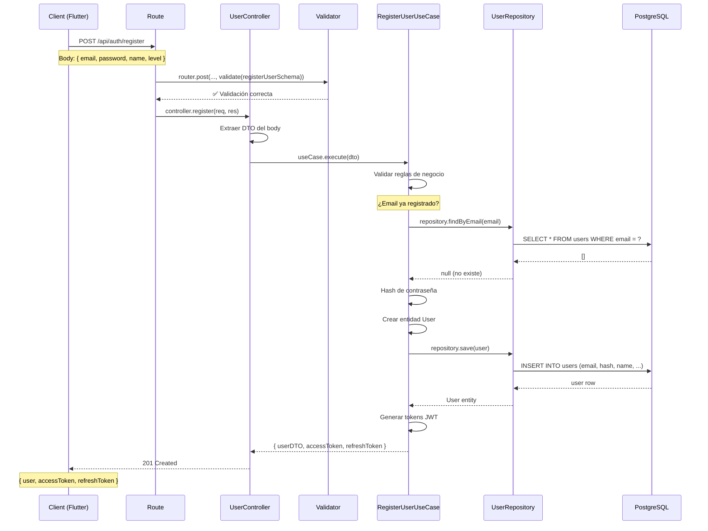
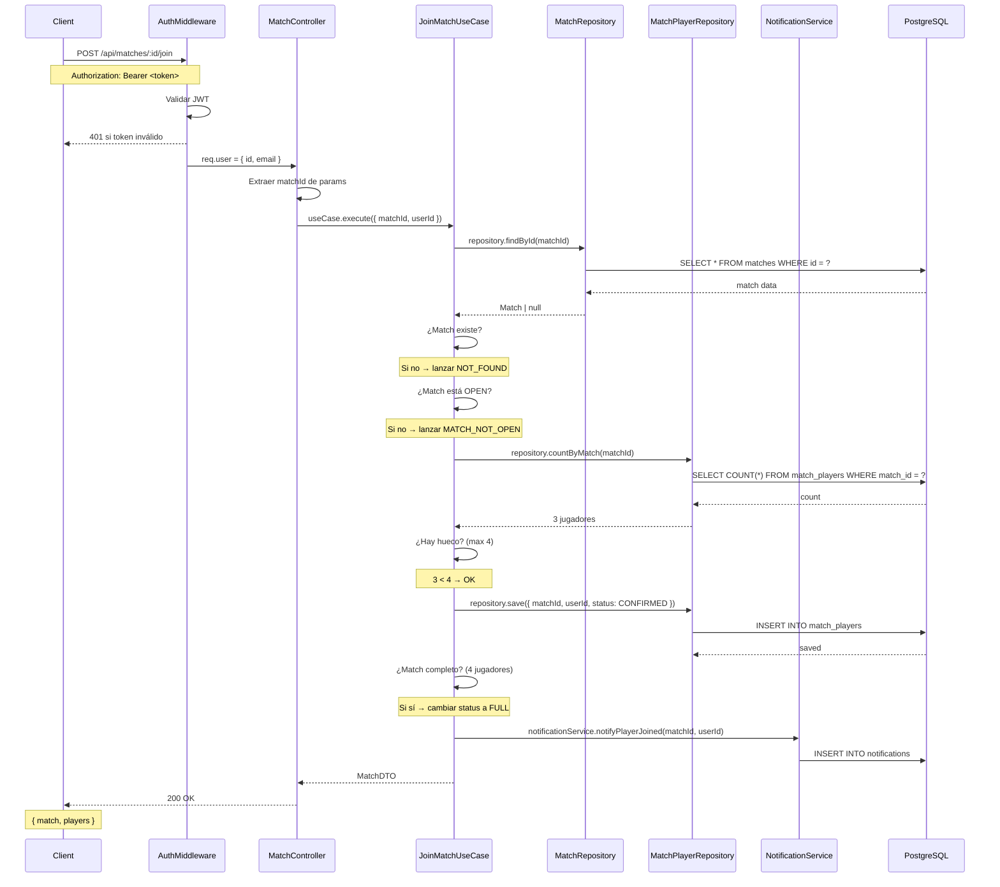
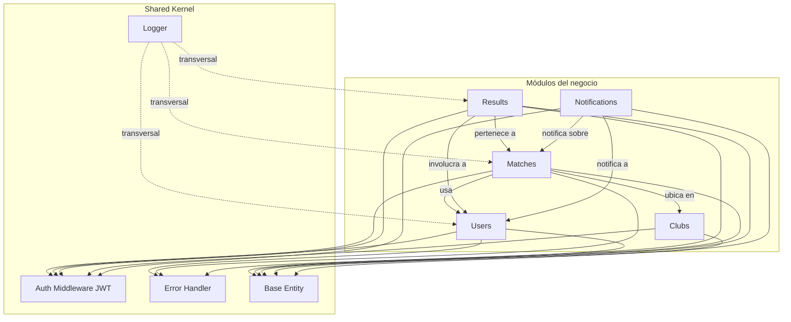
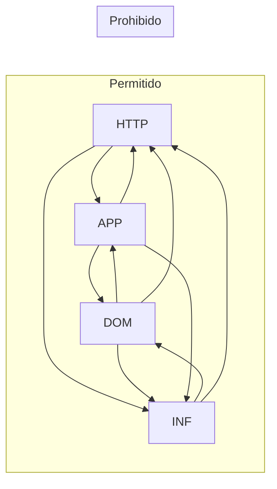
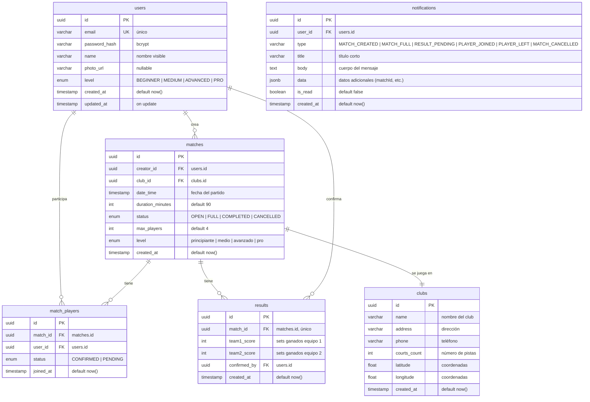
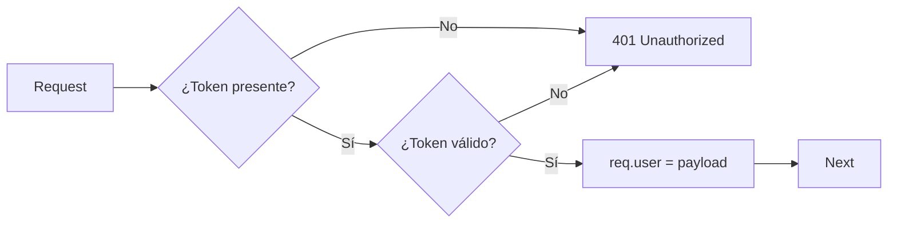
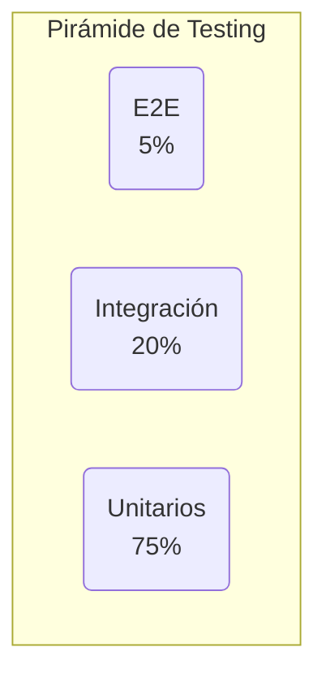

# 🏗️ Arquitectura del Backend — PanchisPádel

> Documento de diseño arquitectónico del backend API.
> **Última actualización**: 13 de mayo de 2026

---

## 1. Principios arquitectónicos

1. **Arquitectura Hexagonal (Puertos y Adaptadores)**: cada módulo aísla la lógica de negocio de la infraestructura.
2. **Modularidad**: cada funcionalidad de negocio es un módulo independiente.
3. **Dependencias unidireccionales**: Domain → Application → Infrastructure → HTTP (nunca al revés).
4. **TDD como método de diseño**: primero el test, luego la implementación, luego la refactorización.
5. **API First**: el contrato de la API se define antes de la implementación.

---

## 2. Arquitectura Hexagonal — Explicación conceptual

Cada módulo de negocio (`users`, `matches`, `results`, `clubs`, `notifications`) se organiza en **4 capas**:

### 2.1 Domain (Dominio)

**Propósito**: Contiene la esencia del negocio. No depende de nada externo.

**Contenido típico**:
- **Entidades**: `User.ts`, `Match.ts`, `Result.ts`
- **Value Objects**: `Email.ts`, `Password.ts`, `Level.ts`, `MatchStatus.ts`
- **Interfaces de repositorio**: `IUserRepository.ts`, `IMatchRepository.ts` (solo contratos, sin implementación)
- **Enums**: `PlayerLevel`, `MatchStatus`

**Reglas**:
- ❌ No importa de Express, TypeORM, ni ninguna librería externa.
- ❌ No contiene lógica de infraestructura.
- ✅ Solo tipos de TypeScript y lógica de negocio pura.
- ✅ Puede definir factories para crear entidades con invariantes.

### 2.2 Application (Aplicación)

**Propósito**: Orquesta los casos de uso del sistema. Recibe input del exterior, valida reglas de negocio y coordina el flujo.

**Contenido típico**:
- **Casos de uso**: `RegisterUser.ts`, `CreateMatch.ts`, `JoinMatch.ts`
- **DTOs**: `RegisterUserDTO.ts`, `CreateMatchDTO.ts`
- **Interfaces de servicios secundarios**: `INotificationService.ts`, `ITokenService.ts`

**Reglas**:
- ✅ Conoce solo a la capa Domain.
- ❌ No conoce Express, TypeORM ni HTTP.
- ❌ No maneja objetos Request/Response.
- ✅ Cada caso de uso tiene una única responsabilidad.

### 2.3 Infrastructure (Infraestructura)

**Propósito**: Implementa los contratos definidos en Domain y Application.

**Contenido típico**:
- **Repositorios concretos**: `PostgresUserRepository.ts` (implementa `IUserRepository` usando TypeORM)
- **Servicios concretos**: `JwtTokenService.ts`, `NodeMailerService.ts`
- **Entidades de TypeORM** (mapeo ORM): `UserEntity.ts`, `MatchEntity.ts`

**Reglas**:
- ✅ Implementa interfaces de Domain.
- ✅ Depende de librerías externas (TypeORM, JWT, etc.).
- ❌ No contiene lógica de negocio (solo implementación técnica).

### 2.4 HTTP (Interface de usuario / Controladores)

**Propósito**: Maneja la interacción con el mundo exterior (peticiones HTTP).

**Contenido típico**:
- **Controladores**: `UserController.ts`, `MatchController.ts`
- **Rutas**: `UserRoutes.ts`, `MatchRoutes.ts`
- **Validadores**: `registerUserValidator.ts`, `createMatchValidator.ts` (usando express-validator o zod)

**Reglas**:
- ✅ Recibe requests HTTP, llama a casos de uso, devuelve respuestas.
- ❌ No contiene lógica de negocio.
- ❌ No llama directamente a repositorios.

---

## 3. Diagrama de flujo de una petición

### 3.1 Registro de usuario (POST /api/auth/register)



### 3.2 Unirse a un partido (POST /api/matches/:id/join)



---

## 4. Diagrama de dependencias entre módulos



---

## 5. Reglas de dependencia (críticas)

Estas reglas son **obligatorias** y se verifican en code review y lint:

| # | Regla | Descripción |
|---|-------|-------------|
| 1 | **Domain no conoce a nadie** | Ni Express, ni TypeORM, ni otras capas. Solo TypeScript puro. |
| 2 | **Application conoce solo a Domain** | Puede importar entidades, value objects e interfaces de repositorio de Domain. |
| 3 | **Infrastructure implementa interfaces de Domain** | Los repositorios concretos implementan `IUserRepository`, `IMatchRepository`, etc. |
| 4 | **HTTP conoce a Application e Infrastructure** | Los controladores importan casos de uso y DTOs. |
| 5 | **Prohibido: importar desde Infrastructure en Domain** | Si Domain necesita algo externo, se define como interfaz. |

### Flujo de importaciones permitido



---

## 6. Base de datos

### 6.1 Diagrama entidad-relación



### 6.2 Convenciones de base de datos

- **IDs**: UUID v4 generados desde la aplicación (no secuenciales).
- **Timestamps**: `created_at` y `updated_at` en todas las tablas.
- **Soft delete**: no implementado en V1 (se usa borrado físico).
- **Índices**: índice compuesto en `match_players(match_id, user_id)` para unique constraint.
- **Migraciones**: generadas con TypeORM, versionadas en `src/migrations/`.

### 6.3 Esquema SQL (equivalente DDL)

```sql
CREATE EXTENSION IF NOT EXISTS "uuid-ossp";

CREATE TYPE player_level AS ENUM ('BEGINNER', 'MEDIUM', 'ADVANCED', 'PRO');
CREATE TYPE match_status AS ENUM ('OPEN', 'FULL', 'COMPLETED', 'CANCELLED');
CREATE TYPE player_status AS ENUM ('CONFIRMED', 'PENDING');
CREATE TYPE notification_type AS ENUM (
    'MATCH_CREATED', 'MATCH_FULL', 'RESULT_PENDING', 'PLAYER_JOINED', 'PLAYER_LEFT', 'MATCH_CANCELLED'
);

CREATE TABLE users (
    id UUID PRIMARY KEY DEFAULT uuid_generate_v4(),
    email VARCHAR(255) UNIQUE NOT NULL,
    password_hash VARCHAR(255) NOT NULL,
    name VARCHAR(100) NOT NULL,
    photo_url VARCHAR(500),
    level player_level NOT NULL DEFAULT 'MEDIUM',
    created_at TIMESTAMP NOT NULL DEFAULT NOW(),
    updated_at TIMESTAMP NOT NULL DEFAULT NOW()
);

CREATE TABLE clubs (
    id UUID PRIMARY KEY DEFAULT uuid_generate_v4(),
    name VARCHAR(200) NOT NULL,
    address VARCHAR(300),
    phone VARCHAR(20),
    courts_count INT NOT NULL DEFAULT 1,
    latitude FLOAT,
    longitude FLOAT,
    created_at TIMESTAMP NOT NULL DEFAULT NOW()
);

CREATE TABLE matches (
    id UUID PRIMARY KEY DEFAULT uuid_generate_v4(),
    creator_id UUID NOT NULL REFERENCES users(id),
    club_id UUID NOT NULL REFERENCES clubs(id),
    date_time TIMESTAMP NOT NULL,
    duration_minutes INT NOT NULL DEFAULT 90,
    status match_status NOT NULL DEFAULT 'OPEN',
    max_players INT NOT NULL DEFAULT 4,
    level player_level NOT NULL DEFAULT 'MEDIUM',
    created_at TIMESTAMP NOT NULL DEFAULT NOW()
);

CREATE TABLE match_players (
    id UUID PRIMARY KEY DEFAULT uuid_generate_v4(),
    match_id UUID NOT NULL REFERENCES matches(id),
    user_id UUID NOT NULL REFERENCES users(id),
    status player_status NOT NULL DEFAULT 'CONFIRMED',
    joined_at TIMESTAMP NOT NULL DEFAULT NOW(),
    UNIQUE(match_id, user_id)
);

CREATE TABLE results (
    id UUID PRIMARY KEY DEFAULT uuid_generate_v4(),
    match_id UUID UNIQUE NOT NULL REFERENCES matches(id),
    team1_score INT NOT NULL,
    team2_score INT NOT NULL,
    confirmed_by UUID REFERENCES users(id),
    created_at TIMESTAMP NOT NULL DEFAULT NOW()
);

CREATE TABLE notifications (
    id UUID PRIMARY KEY DEFAULT uuid_generate_v4(),
    user_id UUID NOT NULL REFERENCES users(id),
    type notification_type NOT NULL,
    title VARCHAR(200) NOT NULL,
    body TEXT,
    data JSONB,
    is_read BOOLEAN NOT NULL DEFAULT FALSE,
    created_at TIMESTAMP NOT NULL DEFAULT NOW()
);

CREATE INDEX idx_match_players_match ON match_players(match_id);
CREATE INDEX idx_match_players_user ON match_players(user_id);
CREATE INDEX idx_notifications_user ON notifications(user_id, is_read);
CREATE INDEX idx_matches_status ON matches(status);
CREATE INDEX idx_matches_date ON matches(date_time);
```

---

## 7. Middlewares

### 7.1 Auth Middleware (JWT)



- Extrae el token del header `Authorization: Bearer <token>`.
- Verifica la firma y expiración.
- Agrega `req.user` con `{ id, email }` para los controladores.
- Los endpoints públicos (registro, login, refresh) no usan este middleware.

### 7.2 Error Handler

- Middleware global que captura errores lanzados en casos de uso.
- Mapa de errores de dominio a códigos HTTP:
  - `UserNotFoundError` → 404
  - `EmailAlreadyExistsError` → 409
  - `MatchNotOpenError` → 409
  - `ValidationError` → 400
  - `UnauthorizedError` → 401
- En desarrollo devuelve el stack trace; en producción solo el mensaje.

### 7.3 Logger

- Usa Winston o Pino como logger estructurado.
- Niveles: debug (dev), info (prod), error (siempre).
- Cada request genera un correlation ID para trazabilidad.

---

## 8. Estrategia de testing

| Tipo | Herramienta | Alcance |
|------|-------------|---------|
| Unitarios | Jest | Casos de uso, Value Objects, entidades |
| Integración | Jest + Supertest | Controladores + rutas (sin BD real) |
| E2E | Jest + Supertest | Flujo completo con BD de test |
| Repositorio | Jest + TypeORM | Implementaciones de repositorio |

### Pirámide de tests



- **Prioridad**: unitarios (75%) → integración (20%) → e2e (5%).
- TDD obligatorio: RED → GREEN → REFACTOR en cada caso de uso.

---

## 9. Seguridad

- **Contraseñas**: hash con bcrypt (cost factor 12).
- **JWT**: access token (15 min) + refresh token (7 días) con rotación.
- **Rate limiting**: express-rate-limit en endpoints sensibles (`/auth/login`, `/auth/register`).
- **CORS**: whitelist de orígenes permitidos (frontend en producción).
- **Helmet**: headers de seguridad HTTP.
- **Validación**: todos los inputs validados en la capa HTTP (schema validation) y en Application (reglas de negocio).

---

## 10. Decisiones técnicas (ADR)

| ID | Decisión | Motivación |
|----|----------|------------|
| ADR-001 | UUID v4 vs secuenciales | Evitar enumeración de recursos, mejor para distribución |
| ADR-002 | TypeORM vs Prisma | TypeORM más maduro en el ecosistema Express + TS |
| ADR-003 | JWT stateless vs sesiones | Escalabilidad horizontal, sin estado en servidor |
| ADR-004 | Refresh token rotativo | Mitigar robo de tokens, invalidación rápida |
| ADR-005 | Hexagonal vs MVC | Aislamiento de lógica de negocio, testabilidad |
| ADR-006 | bcrypt vs argon2 | bcrypt es suficiente para V1, bien soportado |

> Ver más detalles en [`/adr/`](../adr/).
