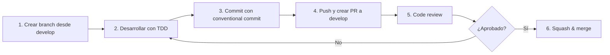
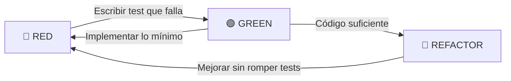

# 🤝 Contribuir a PanchisPádel Backend

Guía para desarrolladores que quieran contribuir al backend de PanchisPádel.

---

## 1. Configuración del entorno local

### 1.1 Requisitos

- Node.js >= 20 LTS
- Docker Desktop
- Git
- Visual Studio Code (recomendado)

### 1.2 Primeros pasos

```bash
# Fork y clone
git clone https://github.com/tu-usuario/panchispadel-backend.git
cd panchispadel-backend

# Rama base
git checkout develop

# Variables de entorno
cp .env.example .env

# Base de datos
docker compose up -d db

# Dependencias
npm install

# Migraciones
npm run migration:run

# Seeds (datos de prueba)
npm run seed

# Tests (verificar que todo funciona)
npm test
```

### 1.3 Hook de pre-commit

El proyecto usa **husky** + **lint-staged** para ejecutar linter y tests antes de cada commit:

```bash
npm run prepare  # Instala husky hooks
```

---

## 2. Flujo de trabajo

### 2.1 Esquema de ramas

```
main (protegida — solo merge desde develop en releases)
  └── develop (integración continua)
        ├── feature/registro-usuarios
        ├── feature/crear-partidos
        ├── fix/validacion-email
        ├── test/cobertura-match
        └── docs/api-endpoints
```

### 2.2 Ciclo de desarrollo



### 2.3 Pasos detallados

```bash
# 1. Partir de develop actualizada
git checkout develop
git pull origin develop

# 2. Crear branch de feature
git checkout -b feature/registro-usuarios

# 3. Desarrollar (TDD: RED → GREEN → REFACTOR)
#    - Escribir test que falla (RED)
#    - Implementar lo mínimo para que pase (GREEN)
#    - Refactorizar sin romper tests (REFACTOR)

# 4. Hacer commits
git add .
git commit -m "feat: agregar registro de usuarios"

# 5. Mantener branch actualizada con develop
git fetch origin
git rebase origin/develop

# 6. Pushear y crear PR
git push origin feature/registro-usuarios
```

---

## 3. Convenciones de commits

Usamos **Conventional Commits** con descripciones en **español**.

### Formato

```
<tipo>: <descripción en presente y modo imperativo>
```

### Tipos permitidos

| Tipo | Cuándo usarlo | Ejemplo |
|------|---------------|---------|
| `feat` | Nueva funcionalidad | `feat: agregar registro de usuarios` |
| `fix` | Corrección de bug | `fix: corregir validación de email duplicado` |
| `test` | Agregar o modificar tests | `test: agregar tests de CreateMatch` |
| `refactor` | Cambio que no agrega funcionalidad ni corrige bugs | `refactor: extraer lógica de validación a helper` |
| `docs` | Cambios en documentación | `docs: actualizar endpoints de autenticación` |
| `style` | Cambios de formato (espacios, comas, etc.) | `style: aplicar prettier a archivos del módulo users` |
| `chore` | Cambios en configuración, dependencias, CI | `chore: actualizar dependencias de seguridad` |
| `perf` | Mejora de rendimiento | `perf: cachear consulta de clubes` |

### Reglas

- **Descripciones en español**, en presente y modo imperativo.
- **Máximo 72 caracteres** en la primera línea.
- Opcional: cuerpo del mensaje explicando el **qué** y el **por qué** (no el cómo).

```bash
# Bueno
feat: agregar validación de email en registro

# Malo
added validation to email field
fixed bug
update stuff
```

---

## 4. Convenciones de código

### 4.1 TypeScript

- **strict mode**: siempre activo en `tsconfig.json`.
- **Nombres**:
  - Clases, interfaces, tipos: `PascalCase` → `User`, `IMatchRepository`, `RegisterUserDTO`
  - Funciones, métodos, variables: `camelCase` → `findByEmail()`, `execute()`
  - Archivos: `camelCase.ts` → `registerUser.ts`, `userController.ts`
  - Carpetas: `kebab-case` → `match-players`, `value-objects`
  - Constantes globales: `UPPER_SNAKE_CASE` → `JWT_EXPIRES_IN`
- **Interfaces**: prefijo `I` para interfaces de repositorio → `IUserRepository`.
- **Evitar `any`**: usar `unknown` y narrowing en su lugar.

### 4.2 Estructura de archivos

Cada módulo sigue esta estructura exacta:

```
modules/
└── matches/
    ├── domain/
    │   ├── Match.ts              # Entidad
    │   ├── MatchStatus.ts        # Value Object / Enum
    │   └── IMatchRepository.ts   # Puerto (interfaz)
    ├── application/
    │   ├── CreateMatch.ts        # Caso de uso
    │   ├── CreateMatchDTO.ts     # DTO de entrada
    │   └── MatchDTO.ts           # DTO de salida
    ├── infrastructure/
    │   ├── TypeOrmMatchRepository.ts  # Adaptador
    │   └── MatchEntity.ts            # Entidad TypeORM
    └── http/
        ├── MatchController.ts    # Controlador Express
        ├── MatchRoutes.ts        # Definición de rutas
        └── createMatchValidator.ts  # Schema de validación
```

### 4.3 Imports

Orden de imports (separados por línea en blanco):

```typescript
// 1. Librerías externas
import { Request, Response } from 'express';
import { IsEmail, IsString } from 'class-validator';

// 2. Módulos del proyecto (primero domain, luego application, etc.)
import { User } from '../../../domain/User';
import { RegisterUserDTO } from '../../application/RegisterUserDTO';
import { IUserRepository } from '../../../domain/IUserRepository';

// 3. Shared kernel
import { BaseController } from '../../../../shared/infrastructure/BaseController';

// 4. Tipos
import type { UserResponse } from '../../../domain/types';
```

### 4.4 Principios

| Principio | Aplicación |
|-----------|------------|
| **KISS** | No overengineer. Si algo se puede hacer simple, hazlo simple. |
| **DRY** | No repetir lógica. Extraer a shared si se usa en 2+ módulos. |
| **YAGNI** | No implementar nada que no se necesite ahora. |
| **Single Responsibility** | Cada clase, un motivo de cambio. |
| **Small Methods** | Métodos de < 20 líneas. Si es más largo, extraer. |

---

## 5. TDD obligatorio

### 5.1 Ciclo



### 5.2 Reglas

1. **RED primero**: nunca escribas código de producción sin un test que falle.
2. **GREEN rápido**: implementa lo mínimo indispensable para que el test pase.
3. **REFACTOR siempre**: mejora el diseño sin agregar comportamiento.
4. **Un test por comportamiento**: no agrupar assertions de distintas responsabilidades.
5. **Nombrar tests en español**: `debería registrar un usuario válido`, `debería rechazar email duplicado`.

### 5.3 Ejemplo

```typescript
// tests/modules/users/application/RegisterUser.spec.ts
describe('RegisterUser', () => {
  it('debería registrar un usuario válido', async () => {
    // Arrange
    const dto = new RegisterUserDTO({
      email: 'jugador@email.com',
      password: 'Password123!',
      name: 'Carlos',
      level: 'MEDIUM',
    });

    // Act
    const result = await useCase.execute(dto);

    // Assert
    expect(result.user.email).toBe('jugador@email.com');
    expect(result.accessToken).toBeDefined();
  });

  it('debería rechazar email duplicado', async () => {
    // Arrange
    const dto = new RegisterUserDTO({ ...validDto, email: 'existente@email.com' });
    mockRepo.findByEmail.mockResolvedValue(existingUser);

    // Act & Assert
    await expect(useCase.execute(dto)).rejects.toThrow(EmailAlreadyExistsError);
  });
});
```

---

## 6. Tests

### 6.1 Comandos

```bash
npm test              # Ejecutar toda la suite
npm run test:watch    # Modo watch (desarrollo)
npm run test:coverage # Reporte de cobertura
```

### 6.2 Estructura de tests

```
tests/
├── unit/
│   ├── modules/
│   │   ├── users/application/    # Tests de casos de uso
│   │   ├── users/domain/         # Tests de entidades y VO
│   │   ├── matches/application/
│   │   └── matches/domain/
│   └── shared/                   # Tests de utilidades
├── integration/
│   ├── users/http/               # Tests de controladores
│   └── matches/http/
└── e2e/
    └── flows/                    # Tests de flujo completo
```

### 6.3 Cobertura mínima

- **Domain**: 100% (lógica de negocio crítica).
- **Application**: 90%+ (casos de uso).
- **HTTP/Controllers**: 80%+ (controladores).
- **Infrastructure**: 60%+ (repositorios, integración).

---

## 7. Code Review — Checklist

Cada PR debe ser revisado por al menos un compañero. El revisor verifica:

### 7.1 Checklist del revisor

- [ ] **Arquitectura**: ¿Respeta la separación hexagonal? (Domain no importa de Infrastructure)
- [ ] **TDD**: ¿Hay tests primero? ¿Los tests cubren casos borde?
- [ ] **Nomenclatura**: ¿Nombres claros en español? ¿Sigue las convenciones?
- [ ] **Errores**: ¿Los errores de dominio se traducen correctamente a códigos HTTP?
- [ ] **Seguridad**: ¿Se validan inputs? ¿No hay fugas de información sensible?

### 7.2 Checklist del autor del PR

- [ ] `npm test` pasa completo.
- [ ] `npm run lint` sin errores.
- [ ] `npm run build` compila sin errores.
- [ ] Tests nuevos escritos antes del código (TDD).
- [ ] Commits siguen el formato Conventional Commits.

---

## 8. Política de ramas

| Rama | Propósito | Protegida | Merge a |
|------|-----------|-----------|---------|
| `main` | Producción (releases) | Sí | — |
| `develop` | Integración continua | Sí | `main` |
| `feature/*` | Nuevas funcionalidades | No | `develop` |
| `fix/*` | Corrección de bugs | No | `develop` |
| `test/*` | Agregar o mejorar tests | No | `develop` |
| `docs/*` | Documentación | No | `develop` |
| `release/*` | Preparación de release | No | `main` y `develop` |

### Reglas

- `main` y `develop` están **protegidas**: no se puede pushear directamente.
- Todo cambio entra por **Pull Request** con al menos 1 approval.
- Los PR deben mantener un **historial lineal** (rebase, no merge commits).
- Usar **squash & merge** para integrar features a `develop`.

---

## 9. Gestión de issues

Usamos GitHub Projects para gestionar el backlog.

### Labels

| Label | Significado |
|-------|-------------|
| `bug` | Error en producción |
| `enhancement` | Nueva funcionalidad |
| `tech-debt` | Refactor técnico |
| `good-first-issue` | Para nuevos contribuidores |
| `priority-high` | Bloqueante para el release |

### Asignación

- Cada issue tiene un **único responsable** asignado.
- Issues sin asignar están disponibles para cualquiera.
- Mover el issue a `In Progress` cuando se empiece a trabajar.

---

## 10. Recursos

- [Documentación de Arquitectura](./ARCHITECTURE.md)
- [API Endpoints](./API.md)
- [ADR (Architecture Decision Records)](../adr/)
- [TypeORM Documentation](https://typeorm.io/)
- [Express.js Guide](https://expressjs.com/)
- [Jest Documentation](https://jestjs.io/)
